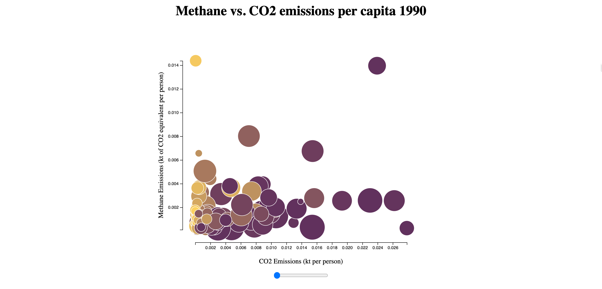

# Data Visualization Using D3.js

**Demo deployed with netlify:** https://d3-scatterplot.netlify.app/

## Screenshot

## Overview
This is an example scatter plot built with D3. It is a simple application that graphs methane versus CO2 emissions per capita for different regions around the world.